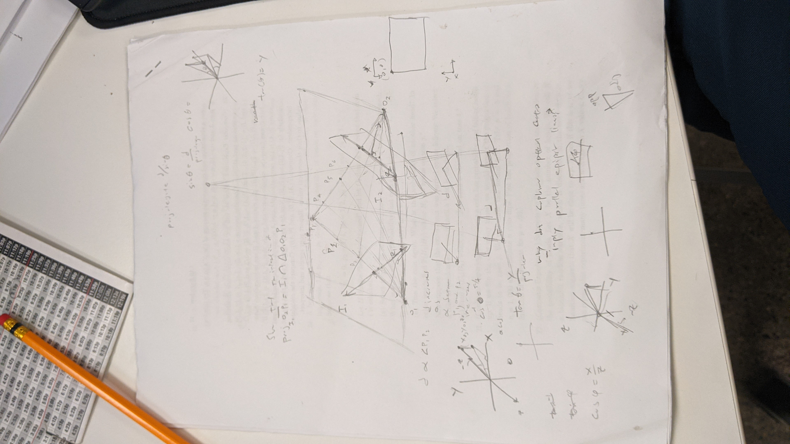
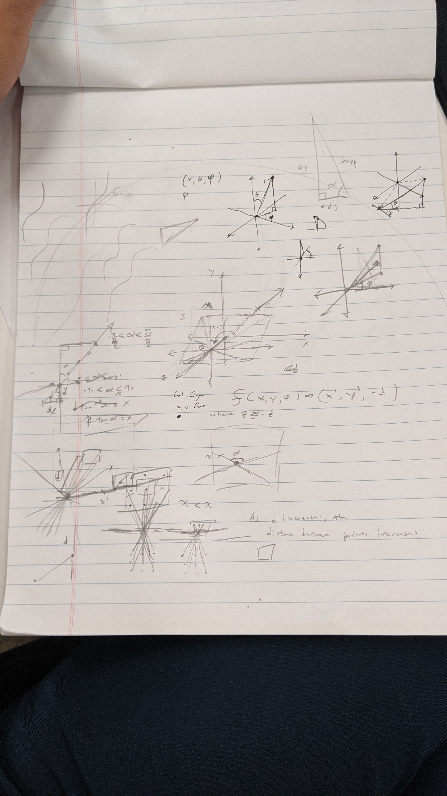
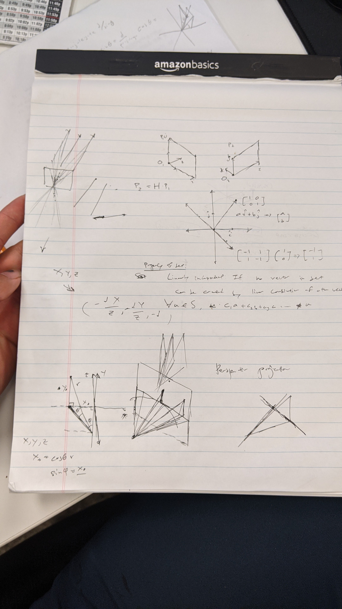
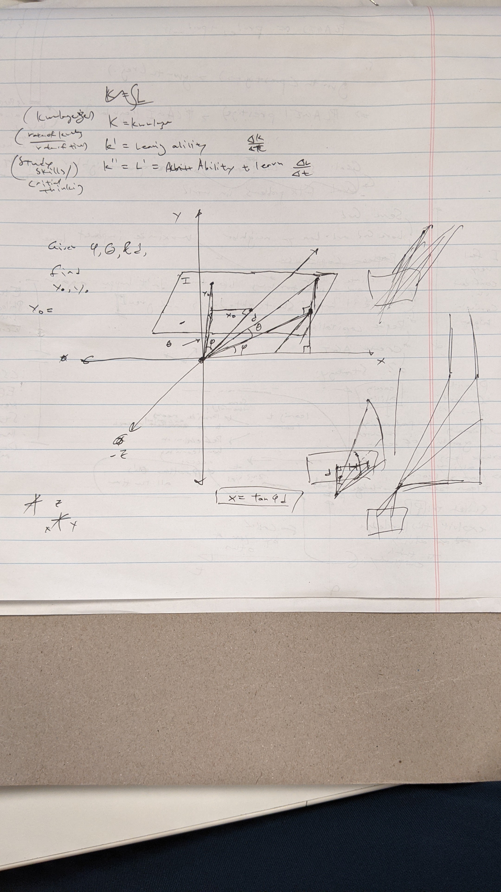
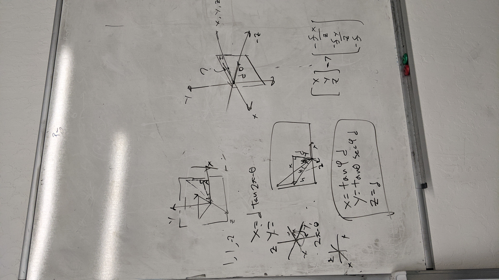
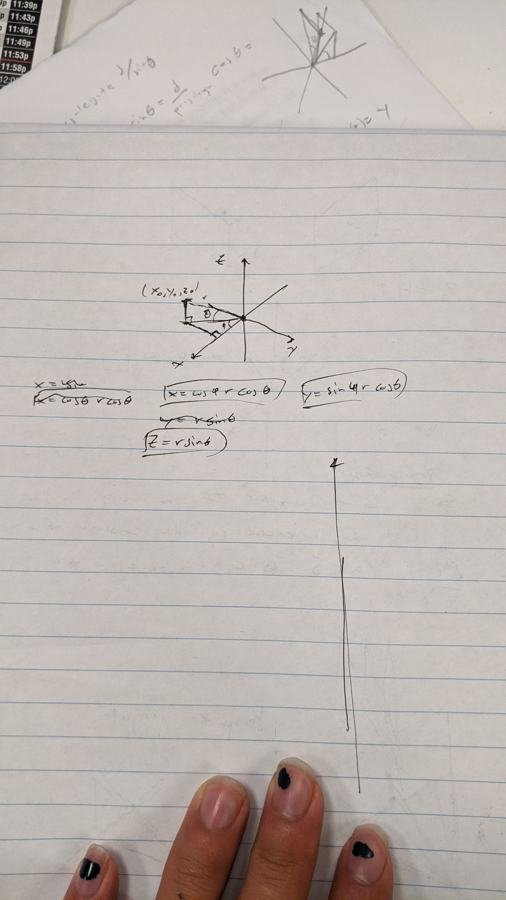

# perspective-projection

One of the more difficult problems I've had the fortune to stumble across: Trying to do perspective projection with spherical coordinates. My spherical system is a little different from the traditional one - phi is measured from -z onto the xy plane rather than traidtionally from x onto the the yz plane, and theta is measured from y onto the xz plane rather than z onto the xy plane. I did this because the traditional perspective projection measures objects protruding from the -z axis, to preserve the right-hand rule. Theory and notes attached below.

